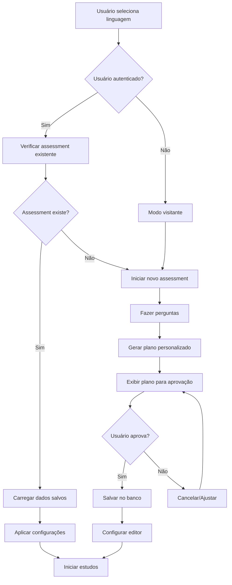

# 🚀 Melhorias no Fluxo de Assessment - LearnAI

## 📋 Resumo das Implementações

Este documento descreve as melhorias implementadas no sistema de assessment inicial do LearnAI, focando na personalização, persistência de dados e experiência do usuário.

## ✨ Principais Melhorias

### 1. **Integração com Sistema de Autenticação Real**
- ✅ Integração do hook `useAuth` no componente `InitialAssessment`
- ✅ Uso do `userId` real do usuário autenticado
- ✅ Suporte a usuários anônimos com IDs temporários
- ✅ Indicadores visuais do status de autenticação

### 2. **Plano Personalizado com Aprovação**
- ✅ Geração automática de plano de estudos baseado no perfil
- ✅ Interface para revisão e aprovação do plano antes de salvar
- ✅ Planos adaptativos por nível (iniciante, intermediário, avançado)
- ✅ Integração do plano no sistema de salvamento

### 3. **Persistência Inteligente de Dados**
- ✅ Verificação de assessments existentes por usuário e linguagem
- ✅ Salvamento estruturado no banco de dados
- ✅ Recuperação automática de perfis salvos
- ✅ Prevenção de assessments duplicados

### 4. **Controle Inteligente do Editor**
- ✅ Limpeza condicional do editor baseada no plano
- ✅ Manutenção de código de exemplo para usuários intermediários
- ✅ Reset completo para usuários experientes

### 5. **Experiência do Usuário Aprimorada**
- ✅ Mensagens personalizadas baseadas no status de autenticação
- ✅ Indicadores visuais de progresso e status
- ✅ Feedback claro sobre ações de salvamento
- ✅ Interface responsiva e acessível

## 🏗️ Arquivos Modificados/Criados

### Componentes Principais
- **`src/components/InitialAssessment.tsx`** - Componente principal com todas as melhorias
- **`src/components/AssessmentSummary.tsx`** - Novo componente para exibir histórico

### Hooks e Utilitários
- **`src/hooks/useAssessment.ts`** - Novo hook para gerenciamento de assessments
- **`src/hooks/useAuth.tsx`** - Hook existente integrado

### APIs e Banco
- **`src/app/api/assessment/route.ts`** - API existente compatível
- **`prisma/schema.prisma`** - Schema existente compatível

## 📊 Fluxo Completo Implementado

## 🔧 Como Usar

### Para Usuários Autenticados
1. Selecionar linguagem
2. Sistema verifica se já existe assessment
3. Se existe: carrega dados automaticamente
4. Se não existe: inicia novo assessment conversacional
5. Gera plano personalizado
6. Usuário revisa e aprova
7. Dados salvos no perfil do usuário

### Para Usuários Visitantes
1. Selecionar linguagem
2. Sempre inicia novo assessment
3. Gera plano personalizado
4. Usuário revisa e aprova
5. Configurações aplicadas apenas para sessão atual

## 🎯 Funcionalidades Principais

### Planos Adaptativos
- **Iniciante**: Conceitos básicos, exemplos simples, editor limpo
- **Intermediário**: Conceitos avançados, código de referência
- **Avançado**: Tópicos complexos, editor limpo para experimentação

### Personalização por Linguagem
- Perguntas específicas para cada linguagem
- Conceitos relevantes por tecnologia
- Objetivos adaptados ao contexto

### Gerenciamento de Estado
- Estado local para interação em tempo real
- Persistência no banco para usuários autenticados
- Sincronização entre sessões

## 🔮 Próximos Passos Sugeridos

### Melhorias Futuras
1. **Dashboard de Progresso**: Visualização completa do progresso por linguagem
2. **Planos Editáveis**: Permitir ajustes manuais nos planos gerados
3. **Recomendações Inteligentes**: Sugestões baseadas em assessments anteriores
4. **Compartilhamento**: Permitir compartilhar planos de estudo
5. **Gamificação**: Sistema de conquistas e marcos

### Otimizações
1. **Cache Local**: Armazenar dados temporariamente no localStorage
2. **Sincronização Offline**: Permitir uso sem conexão
3. **Performance**: Lazy loading de componentes pesados
4. **Analytics**: Métricas de uso e eficácia dos planos

## 📈 Métricas de Sucesso

- **Taxa de Conclusão**: % de usuários que completam o assessment
- **Taxa de Aprovação**: % de planos aprovados pelos usuários
- **Retenção**: % de usuários que retornam para estudar
- **Satisfação**: Feedback sobre qualidade dos planos gerados

## 🛠️ Tecnologias Utilizadas

- **Next.js 14** com App Router
- **TypeScript** para tipagem forte
- **Tailwind CSS** para estilização
- **Prisma** para banco de dados
- **React Hooks** para gerenciamento de estado
- **API Routes** para comunicação com backend

---

## 🎉 Conclusão

O sistema de assessment agora oferece uma experiência completa e personalizada, com integração real ao sistema de autenticação, persistência inteligente de dados e planos adaptativos que se ajustam ao perfil de cada usuário. 

A arquitetura modular permite fácil extensão e manutenção, enquanto a interface amigável garante uma experiência de usuário fluida tanto para iniciantes quanto para desenvolvedores experientes.
