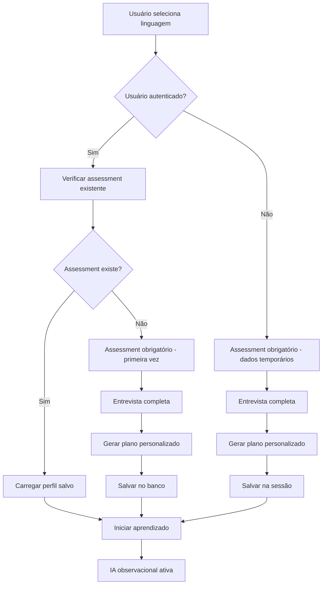

# 📋 Sistema de Assessment Obrigatório por Linguagem

## 🔧 Correções Implementadas (v2.0)

### **Problemas Identificados e Corrigidos:**

#### ❌ **Problema 1: Editor não era limpo corretamente**
- **Causa**: Ação executada antes da aprovação do plano
- **Solução**: Limpeza/demo executada apenas APÓS aprovação

#### ❌ **Problema 2: Plano não mostrado para aprovação**  
- **Causa**: Assessment pulava direto para execução
- **Solução**: Interface de aprovação obrigatória antes de salvar

#### ❌ **Problema 3: Análise incorreta de experiência**
- **Causa**: Não distinguia experiência geral vs específica da linguagem
- **Solução**: Priorização da experiência específica na análise

#### ❌ **Problema 4: Salvamento não automático após aprovação**
- **Causa**: Perfil não era salvo automaticamente
- **Solução**: Salvamento automático integrado na aprovação

### **Fluxo Corrigido:**

```typescript
1. Assessment Completo → 
2. Análise de Respostas (priorizando experiência específica) →
3. Geração de Plano Personalizado →
4. EXIBIÇÃO DO PLANO PARA APROVAÇÃO →
5. Usuário aprova → 
6. Salvamento no Banco →
7. Aplicação das configurações (limpeza/demo) →
8. Início do aprendizado
```

### **Melhorias na Interface:**

#### **Análise Mais Precisa:**
- ✅ **Experiência específica** prioritária sobre geral
- ✅ **Níveis mais realistas** (geral experiente + linguagem nova = beginner/intermediate)
- ✅ **Feedback detalhado** do perfil analisado

#### **Interface de Aprovação Aprimorada:**
- ✅ **Resumo do perfil** analisado
- ✅ **Plano detalhado** com módulos e objetivos
- ✅ **Explicação clara** do que acontecerá após aprovação
- ✅ **Status de salvamento** (permanente vs temporário)

#### **Execução Pós-Aprovação:**
- ✅ **Salvamento automático** no banco
- ✅ **Limpeza condicional** do editor (apenas advanced)
- ✅ **Demo apropriada** para beginners/intermediates
- ✅ **Mensagem de confirmação** detalhada

## 🎯 Nova Política Implementada

### **Regra Principal:**
**Cada usuário DEVE fazer obrigatoriamente uma entrevista (assessment) para cada linguagem/matéria pelo menos uma vez. Depois disso, o sistema usa automaticamente o melhor perfil salvo.**

## 🔄 Fluxo Atualizado

### 1. **Primeira Vez em uma Linguagem**
- ✅ **Assessment OBRIGATÓRIO** - Não há como pular
- ✅ **Entrevista completa** com 3 perguntas específicas
- ✅ **Plano personalizado** gerado baseado nas respostas
- ✅ **Perfil salvo** no banco de dados por linguagem

### 2. **Retorno à Linguagem**
- ✅ **Carregamento automático** do perfil salvo
- ✅ **Mensagem de boas-vindas** personalizada
- ✅ **Pula direto** para o aprendizado
- ✅ **Usa configurações** já definidas

## 📊 Implementações Técnicas

### **Verificação de Assessment Existente**
```typescript
const checkExistingAssessment = useCallback(async () => {
  if (!user) return false;
  
  try {
    const response = await fetch(`/api/assessment?userId=${user.id}&language=${language}`);
    if (response.ok) {
      const existingAssessment = await response.json();
      return existingAssessment;
    }
  } catch (error) {
    console.error('Erro ao verificar assessment existente:', error);
  }
  return false;
}, [user, language]);
```

### **Lógica de Inicialização**
```typescript
if (user) {
  const existingAssessment = await checkExistingAssessment();
  
  if (existingAssessment) {
    // ✅ Já fez assessment - carregar perfil
    loadExistingProfile(existingAssessment);
  } else {
    // ❌ Primeira vez - assessment obrigatório
    startMandatoryAssessment();
  }
} else {
  // Visitante - sempre fazer assessment
  startGuestAssessment();
}
```

## 🎨 Melhorias na UX

### **Mensagens Personalizadas**

#### **Assessment Obrigatório:**
```
"Oi João! 👋 Primeira vez com Python? Perfeito! 
Preciso te conhecer melhor nesta linguagem para criar 
o melhor plano de estudos. Esta entrevista é obrigatória 
e será salva no seu perfil."
```

#### **Retorno à Linguagem:**
```
"Oi João! 👋 Bem-vindo de volta ao Python! 
Como você já fez sua entrevista inicial, vou usar 
seu perfil salvo (intermediário) para continuar 
de onde parou. Vamos programar! 🚀"
```

### **Indicadores Visuais**
- 🟢 **Verde**: Assessment completo
- 🟡 **Amarelo**: Assessment pendente
- 📊 **Estatísticas**: Contador de linguagens avaliadas

## 🆕 Novos Componentes

### **AssessmentStats.tsx**
- Mostra estatísticas de assessments do usuário
- Lista linguagens já avaliadas
- Indica nível de cada linguagem
- Destaca linguagem atual
- Alerta para assessments pendentes

### **Funcionalidades:**
- ✅ **Progresso visual** por linguagem
- ✅ **Histórico de assessments**
- ✅ **Status atual** clara
- ✅ **Navegação** entre linguagens

## 🔐 Controles de Acesso

### **Usuários Autenticados**
- ✅ **Perfis salvos** permanentemente
- ✅ **Sincronização** entre dispositivos
- ✅ **Histórico completo** de assessments
- ✅ **Estatísticas detalhadas**

### **Usuários Visitantes**
- ✅ **Assessment obrigatório** por sessão
- ⚠️ **Dados temporários** (não salvos)
- ✅ **Funcionalidade completa** durante a sessão
- 💡 **Incentivo ao cadastro** para salvar progresso

## 📈 Benefícios da Nova Abordagem

### **Para o Sistema:**
1. **Dados consistentes** - Todo usuário tem perfil definido
2. **Personalização garantida** - Não há "modo genérico"
3. **Qualidade da experiência** - Sempre adaptada ao nível
4. **Analytics melhores** - Dados estruturados por linguagem

### **Para o Usuário:**
1. **Experiência personalizada** desde o início
2. **Progressão natural** respeitando o nível
3. **Continuidade** entre sessões
4. **Clareza** sobre progresso e capacidades

## 🔄 Fluxo Técnico Detalhado



## 🎯 Próximos Passos

### **Melhorias Futuras:**
1. **Assessment evolutivo** - Atualizar perfil baseado no progresso
2. **Reassessment opcional** - Permitir refazer assessment se quiser
3. **Assessment comparativo** - Mostrar evolução entre avaliações
4. **Recomendações inteligentes** - Sugerir próximas linguagens baseado no perfil

### **Analytics:**
1. **Taxa de conclusão** de assessments
2. **Tempo médio** de entrevista
3. **Distribuição de níveis** por linguagem
4. **Retenção** após assessment

---

## 🎉 Resumo

✅ **Assessment obrigatório** para cada linguagem  
✅ **Perfil salvo** permanentemente para usuários autenticados  
✅ **Carregamento automático** em visitas subsequentes  
✅ **Experiência personalizada** garantida  
✅ **UX clara** sobre status e progresso  
✅ **Componentes visuais** para acompanhamento  

O sistema agora garante que **todo usuário tem uma experiência verdadeiramente personalizada** baseada em dados concretos de suas habilidades e preferências! 🚀
